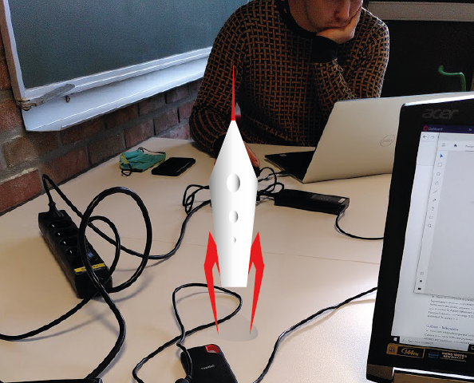

[![Contributors][contributors-shield]][contributors-url]
[![Forks][forks-shield]][forks-url]
[![Stargazers][stars-shield]][stars-url]
[![Issues][issues-shield]][issues-url]
[![MIT License][license-shield]][license-url]
[![LinkedIn][linkedin-shield]][linkedin-url]


<!-- PROJECT LOGO -->
<br />
<p align="center">
  <a href="https://github.com/wouwehb/AR-MultiPlatformTool">
    
  </a>

  <h3 align="center">AR Multiplatform Tool</h3>

  <p align="center">
    A tool to help you analyze metadata of your Turned-based games.
    <br />
    <a href="https://github.com/wouwehb/AR-MultiPlatformTool"><strong>Explore the docs »</strong></a>
    <br />
    <br />
    <a href="https://github.com/wouwehb/AR-MultiPlatformTool">View Demo</a>
    ·
    <a href="https://github.com/wouwehb/AR-MultiPlatformTool/issues">Report Bug</a>
    ·
    <a href="https://github.com/wouwehb/AR-MultiPlatformTool/issues">Request Feature</a>
  </p>
</p>


<!-- TABLE OF CONTENTS -->
<details open="open">
  <summary><h2 style="display: inline-block">Table of Contents</h2></summary>
  <ol>
    <li>
      <a href="#about-the-project">About The Project</a>
      <ul>
        <li><a href="#built-with">Built With</a></li>
      </ul>
    </li>
    <li>
      <a href="#getting-started">Getting Started</a>
      <ul>
        <li><a href="#prerequisites">Prerequisites</a></li>
        <li><a href="#installation">Installation</a></li>
      </ul>
    </li>
    <li><a href="#usage">Usage</a></li>
    <li><a href="#roadmap">Roadmap</a></li>
    <li><a href="#contributing">Contributing</a></li>
    <li><a href="#license">License</a></li>
    <li><a href="#contact">Contact</a></li>
    <li><a href="#acknowledgements">Acknowledgements</a></li>
  </ol>
</details>


## About The Project

[](https://i.imgur.com/RF0TXKP.png)

 Automatically hook your game up to the api to automatically perform various checks and analyze post-game data. like notify you of people with unusualy high win rates; are the cheaters, is their build/play-style overpowered? This api is just a frame-work. Feel free to tinker with it to fulfill your every need.


## Getting Started

To get a local copy up and running follow these simple steps.


### Prerequisites

You will need the latest version of npm
* npm
  ```sh
  npm install npm@latest -g
  ```

You will also require your own database

### Installation

1. Clone the repo
   ```sh
   git clone https://github.com/wouwehb/AR-MultiPlatformTool
   ```
2. Install NPM packages
   ```sh
   npm install
   ```
3. Hook up the api to your game's back-end


## Usage


## Roadmap

See the [open issues](https://github.com/wouwehb/AR-MultiPlatformTool/issues) for a list of proposed features (and known issues).


## Contributing

Contributions are what make the open source community such an amazing place to be learn, inspire, and create. Any contributions you make are **greatly appreciated**.

1. Fork the Project
2. Create your Feature Branch (`git checkout -b feature/AmazingFeature`)
3. Commit your Changes (`git commit -m 'Add some AmazingFeature'`)
4. Push to the Branch (`git push origin feature/AmazingFeature`)
5. Open a Pull Request


## License

Distributed under the MIT License. See `LICENSE` for more information.


## Contact

Your Name - [@brandendeAap](https://twitter.com/BrandendeAap) - wouter.verthongen@student.ehb.be

Project Link: [https://github.com/wouwehb/AR-MultiplatformTool](https://github.com/wouwehb/AR-MultiPlatformTool)


## Acknowledgements

* [Tom Verheirstraeten](https://github.com/tomverheirstraeten/easywavespawner)
* [Jan Everaert](https://github.com/Everaertjan)


<!-- MARKDOWN LINKS & IMAGES -->
<!-- https://www.markdownguide.org/basic-syntax/#reference-style-links -->
[contributors-shield]: https://img.shields.io/github/contributors/wouwehb/AR-MultiplatformTool.svg?style=for-the-badge
[contributors-url]: https://github.com/wouwehb/AR-MultiplatformTool/graphs/contributors
[forks-shield]: https://img.shields.io/github/forks/wouwehb/AR-MultiplatformTool.svg?style=for-the-badge
[forks-url]: https://github.com/wouwehb/AR-MultiplatformTool/network/members
[stars-shield]: https://img.shields.io/github/stars/wouwehb/AR-MultiplatformTool.svg?style=for-the-badge
[stars-url]: https://github.com/wouwehb/AR-MultiplatformTool/stargazers
[issues-shield]: https://img.shields.io/github/issues/wouwehb/AR-MultiplatformTool.svg?style=for-the-badge
[issues-url]: https://github.com/wouwehb/AR-MultiplatformTool/issues
[license-shield]: https://img.shields.io/github/license/wouwehb/AR-MultiplatformTool.svg?style=for-the-badge
[license-url]: https://github.com/wouwehb/AR-MultiplatformTool/blob/main/LICENSE.txt
[linkedin-shield]: https://img.shields.io/badge/-LinkedIn-black.svg?style=for-the-badge&logo=linkedin&colorB=555
[linkedin-url]: https://linkedin.com/in/wouwehb
